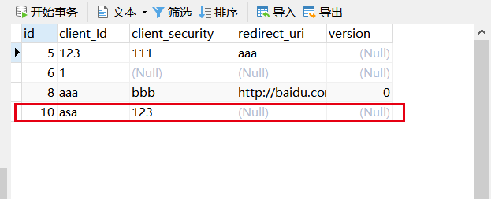
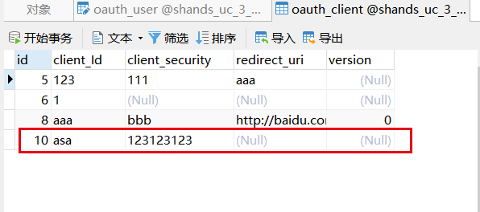
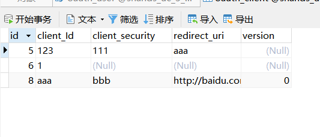

# 实体增强插件第一版
## 需求

在日常的 Java-web 开发过程中时常需要做一些单表的数据操作，常用操作有：单表的新增、单表根据ID查询，单表根据ID删除，单表根据ID修改。对于这四种单表的基本操作时常需要编写很多重复代码如何避免编写重复编写这类代码成了一个问题。面对这样的一个问题我们常规的解决方案有代码生成器，代码生成器可以通过数据库建表语句直接得到Controoler、service、dao三者从而避免重复编写。除此之外笔者思考了另一种处理方式，不通过代码生成器通过一个注解来完成上述操作。


## 设计

首先需要考虑的是四种单表操作的API设计，一般情况下笔者会定义这样的几个API，下面是关于新增的API笔者会设计出如下接口。

- 以用户做新增举例

```
POST http://host:port/user
Content-Type: application/json

// 添加参数
{}
```

- 以部门为例做新增举例

```
POST http://host:port/dept
Content-Type: application/json

// 添加参数
{}
```


对于上述两个API设计可以看到一些大同小异的地方，相同的有都是通过POST进行请求，不同的是后面的路由地址和参数，对于这样两组接口可以抽象为下面一个接口

- 抽象后的新增接口

```
POST http://host:port/{entity_name}
Content-Type: application/json

// 添加参数
{}
```

同样的其他3个操作也可以通过类似的方式进行抽象。

- 根据ID查询接口

```
GET http://host:port/{entity_name}/{id}
```

- 修改接口

```
PUT http://host:port/{entity_name}
Content-Type: application/json

// 修改参数
{}
```

- 根据ID删除接口

```
DELETE http://host:port/{entity_name}/{id}
```


基础接口设计完成，可以先将基本的Controller代码编写完成。


```java
@RestController
public class EntityPluginController {

  @GetMapping("/{entityPluginName}/{id}")
  public ResponseEntity<Object> findById(
      @PathVariable("entityPluginName") String entityPluginName,
      @PathVariable("id") String id
  ) {
    return null;
  }


  @PostMapping("/{entityPluginName}")
  public ResponseEntity<Object> save(
      @PathVariable("entityPluginName") String entityPluginName,
      @RequestBody Object insertParam
  ) {
    return null;
  }

  @PutMapping("/{entityPluginName}")
  public ResponseEntity<Object> update(
      @PathVariable("entityPluginName") String entityPluginName,
      @RequestBody Object updateParam
  ) {
	return null;
  }

  @DeleteMapping("/{entityPluginName}/{id}")
  public ResponseEntity<Object> deleteById(
      @PathVariable("entityPluginName") String entityPluginName,
      @PathVariable("id") String id
  ) {

    return null;
  }
}
```


本文使用JPA作为数据交互层，以JAP作为交互会有2个关键对象，第一个是数据库实体，第二个是Repository接口。通常情况下会选择CrudRepository接口来作为数据交互层的根对象，也有会选择JpaRepository接口来作为数据交互的根对象，这两种存在间接引用，类图如下


了解了常用的JPA操作对象后来看一个Entity对象

```java
@Entity
@Table(name = "oauth_client", schema = "shands_uc_3_back", catalog = "")
public class OauthClientEntity {

  private Long id;
  private String clientId;
  private String clientSecurity;
  private String redirectUri;
  private Long version;
    // 省略getter&setter
}
```

在单表开发过程中我们做的所有行为都是围绕这个数据库实体进行操作，比如在新增的时候将新增参数转换成数据库对象，在更新的是将更新参数转换成数据库对象，在根据ID查询的时候将查询结果(数据库对象)转换为返回结果对象，总共存在三种数据库对象的转换，这三种转换是必不可少的，当然也可以用一个数据库对象直接来满足这个操作从而减少代码量(不建议这么做)，对于这三种转换先来定义一个接口，该接口表示了三种对象的转换过程。

- 数据库对象的三种转换

```java
public interface EntityConvert<InsType, UpType, ResType, EntityType> {

  /**
   * convert data from insert param db entity
   *
   * @param insType insert param
   * @return db entity
   */
  EntityType fromInsType(InsType insType);

  /**
   * convert data from update param to db entity
   *
   * @param upType update param
   * @return db entity
   */
  EntityType fromUpType(UpType upType);

  /**
   * convert data from db entity to response entity
   *
   * @param entityType db entity
   * @return response entity
   */
  ResType fromEntity(EntityType entityType);

}
```

在 `EntityConvert` 接口中定义了4个泛型，含义如下

1. `InsType`：新增时的参数类型
2. `UpType`：修改时的参数类型
3. `ResType`：返回时的参数类型
4. `EntityType`：数据库实体类型

完成接口定义后需要将这个接口的实现类和实体对象绑定，最简单的一种绑定模式就是通过注解来表示，注解定义如下

```java
@java.lang.annotation.Target({ElementType.TYPE})
@java.lang.annotation.Retention(java.lang.annotation.RetentionPolicy.RUNTIME)
@java.lang.annotation.Documented
@java.lang.annotation.Inherited
public @interface EntityPlugin {

  /**
   * name
   *
   * @return name
   */
  String name();

  /**
   * {@link EntityConvert} class
   *
   * @return class
   */
  Class<? extends EntityConvert> convertClass() default EntityConvert.class;
}
```

注解两个函数的含义：

1. name表示实体名称，
2. convertClass表示转换器实现类

下面将注解和实体类进行绑定，具体代码如下

```java
@EntityPlugin(name = "oauthClient")
@Entity
@Table(name = "oauth_client", schema = "shands_uc_3_back", catalog = "")
public class OauthClientEntity {}
```

注意：笔者在这里没有自定义实现 EntityConvert 接口，采用的是默认方式，即参数等于数据库对象

在完成实体对象和转换对象之间的关系绑定后后需要做到的事情是如何调用JPA框架将数据插入。解决这个问题首先需要从JPA接口入手，在JPA接口中都需要定义两个泛型，第一个泛型是实体对象，第二个泛型是ID类型，我们需要通过实体对象来获取前文所编写的注解信息，使用ID泛型为根据ID查询提供参数支持。下面是存储上述信息的对象。

```java
public class EntityPluginCache {

  private String name;
  private Class<? extends EntityConvert> convertClass;
  private CrudRepository crudRepository;
  private Class<?> self;
  private Class<?> idClass;
}
```

1. `name`表示注解`EntityPlugin`的name属性
2. `convertClass` 表示`EventConvert`实现类的类型
3. `crudRepository` 表示JPA数据库操作对象
4. `self` 表示实体类类型
5. `idClass` 表示实体类的ID数据类型

完成这些后我们需要解决的问题就是如何从JPA接口提取类和ID类型，如下面代码所示，我们需要提取`CrudRepository`的两个泛型

```java
@Repository
public interface OauthClientRepo extends CrudRepository<OauthClientEntity ,Long> {

}
```

这里需要使用反射，具体操作代码如下：

```java
public class InterfaceReflectUtils {

  private InterfaceReflectUtils() {

  }

  public static List<Class<?>> getInterfaceGenericLasses(Class<?> check, Class<?> targetClass) {

    if (check == null || targetClass == null) {
      return Collections.emptyList();
    }
    List<Class<?>> res = new ArrayList<>();

    Class<?> cur = check;

    while (cur != null && cur != Object.class) {
      Type[] types = cur.getGenericInterfaces();
      for (Type type : types) {

        // todo: 修改为可以根据类型进行推论
        if (type.getTypeName().contains(targetClass.getName())) {
          Type[] typeArguments = ((ParameterizedType) type).getActualTypeArguments();
          for (Type typeArgument : typeArguments) {
            if (typeArgument instanceof Class) {
              res.add((Class<?>) typeArgument);
            }
          }
          break;

        }
      }
      Class<?>[] interfaces = cur.getInterfaces();
      if (interfaces != null) {
        for (Class<?> inter : interfaces) {
          List<Class<?>> result = getInterfaceGenericLasses(inter, targetClass);
          if (result != null) {
            res.addAll(result);
          }
        }
      }
      cur = cur.getSuperclass();
    }

    return res;
  }


}
```


在得到两个泛型数据后需要进行数据解析和对象组装并将数据存储，数据存储对象如下

```java
public class EntityPluginCacheBean {

  public Map<String, EntityPluginCache> getCacheMap() {
    return cacheMap;
  }

  private final Map<String, EntityPluginCache> cacheMap = new ConcurrentHashMap<>(64);

}
```

接口解析代码如下：

```java
@Component
public class EntityPluginRunner implements ApplicationRunner, ApplicationContextAware, Ordered {

  private static final Logger log = LoggerFactory.getLogger(EntityPluginRunner.class);
  @Autowired
  private ApplicationContext context;
  @Autowired
  private EntityPluginCacheBean entityPluginCacheBean;

  @Override
  public void run(ApplicationArguments args) throws Exception {
    Map<String, CrudRepository> crudRepositoryMap
        = context.getBeansOfType(CrudRepository.class);


    crudRepositoryMap.forEach((k, v) -> {
      Class<?>[] repositoryInterfaces = AopProxyUtils.proxiedUserInterfaces(v);
      for (Class<?> repositoryInterface : repositoryInterfaces) {
        List<Class<?>> interfaceGenericLasses = InterfaceReflectUtils
            .getInterfaceGenericLasses(repositoryInterface,
                CrudRepository.class);
        if (!CollectionUtils.isEmpty(interfaceGenericLasses)) {
          // entity class
          Class<?> entityClass = interfaceGenericLasses.get(0);
          EntityPlugin annotation = entityClass.getAnnotation(EntityPlugin.class);
          if (annotation != null) {

            Map<String, EntityPluginCache> cacheMap = entityPluginCacheBean.getCacheMap();
            EntityPluginCache value = new EntityPluginCache();
            value.setName(annotation.name());
            value.setSelf(entityClass);
            value.setIdClass(interfaceGenericLasses.get(1));
            value.setConvertClass(annotation.convertClass());
            value.setCrudRepository(v);
            if (cacheMap.containsKey(annotation.name())) {
              try {
                if (log.isErrorEnabled()) {
                  log.error("不允许出现相同的EntityPlugin名称 ,entity = [{}]", entityClass);
                }
                throw new Exception("不允许出现相同的EntityPlugin名称");
              } catch (Exception e) {
                e.printStackTrace();
              }
            }
            cacheMap.put(annotation.name(), value);
          }
        }
      }

    });
  }

  @Override
  public void setApplicationContext(ApplicationContext applicationContext) throws BeansException {
    this.context = applicationContext;
  }

  @Override
  public int getOrder() {
    return Ordered.LOWEST_PRECEDENCE;
  }
}
```

注意本例中只支持`CrudRepository`接口暂时不支持它的子类接口，子类接口实现会作为后续开发方向。

至此数据准备都已经完成，接下来就是将Controller开发完成，首先定义一个对应Controller的Service

```java
public interface EntityPluginCoreService {

  Object findById(String entityPluginName, String id);

  Object save(String entityPluginName, Object insertParam);

  Object update(String entityPluginName, Object updateParam);

  Boolean deleteById(String entityPluginName, String id);

}
```

该Service对应了四种操作模式，下面以保存作为一个实例进行说明。保存的Controller相关代码如下

```java
@PostMapping("/{entityPluginName}")
public ResponseEntity<Object> save(
    @PathVariable("entityPluginName") String entityPluginName,
    @RequestBody Object insertParam
) {
  EntityPluginCache entityPluginCache = entityPluginCacheBean.getCacheMap().get(entityPluginName);
  Class<? extends EntityConvert> convertClass = entityPluginCache.getConvertClass();
  if (convertClass != EntityConvert.class) {
    Object save = coreService.save(entityPluginName, insertParam);
    return ResponseEntity.ok(save);
  } else {
    Object o = gson.fromJson(gson.toJson(insertParam), entityPluginCache.getSelf());
    Object save = coreService.save(entityPluginName, o);
    return ResponseEntity.ok(save);

  }
}
```

在Controller这段代码中可以看到有两个分支，这里两个分支的判断是注解`EntityPlugin`中的`convertClass`属性是否为`EntityConvert.class`，如果是说明没有转换过程，即数据库对象就是参数对象，因此可以直接做出下面的转换，请求参数转换成JSON字符串，再通过JSON字符串转换成实体类本身，如果不是则进入核心实现类。核心实现类的相关代码如下

```java
@Override
public Object save(String entityPluginName, Object insertParam) {
  EntityPluginCache entityPluginCache = entityPluginCacheBean.getCacheMap().get(entityPluginName);
  CrudRepository crudRepository = entityPluginCache.getCrudRepository();

  Class<? extends EntityConvert> convertClass = entityPluginCache.getConvertClass();
  if (convertClass == EntityConvert.class) {
    return crudRepository.save(insertParam);
  }
  // 存在转换类的情况下
  if (convertClass != null) {

    String[] beanNamesForType = context.getBeanNamesForType(convertClass);
    // 在 Spring 中能够搜索到
    if (beanNamesForType.length > 0) {
      String beanName = beanNamesForType[0];
      EntityConvert bean = context.getBean(beanName, convertClass);
      // 转换成数据库实体对象
      Object insertDbData = bean.fromInsType(insertParam);
      // 执行插入
      return crudRepository.save(insertDbData);
    }
    // 不能再 Spring 容器中搜索
    else {
      EntityConvert entityConvert;
      try {
        entityConvert = newInstanceFromEntityConvertClass(
            convertClass);
      } catch (Exception e) {
        if (log.isErrorEnabled()) {
          log.error("无参构造初始化失败，{}" + e);
        }
        return null;
      }
      Object insertDbData = entityConvert.fromInsType(insertParam);
      return crudRepository.save(insertDbData);
    }
  }
  // 如果不存在转换器类直接进行插入
  else {
    return crudRepository.save(insertParam);
  }
}
```

在这段代码中处理流程如下：

1. 情况一：注解`EntityPlugin`中的`convertClass`属性是`EntityConvert.class`,直接进JPA相关操作，注意此时的参数已经被Controller转换成实际的数据库对象。
2. 情况二：注解`EntityPlugin`中的`convertClass`属性不是`EntityConvert.class`,此时可能存在两种分类，第一种`convertClass` 交给Spring管理，第二种`convertClass` 不是Spring管理，对应这两种情况分别做出如下两种操作：
   1. 从Spring中根据类型找到所有的bean取第一个作为`EntityConvert`接口的实现类，通过得到的bean进行数据转换在调用JPA相关操作。
   2. 直接通过反射创建`EntityConvert`实现类，注意必须要有一个无参构造，本例使用无参构造进行创建，创建`EntityConvert`实例对象后调用JPA相关操作。


其他代码编写同理，其他实现可以查看这个仓库：https://gitee.com/pychfarm_admin/entity-plugin


## 测试

完成了各类编写后进入测试阶段。

### 新增API测试

- 新增API测试

```
POST http://localhost:8080/oauthClient
Content-Type: application/json
// 参数
{
    "clientId":"asa",
    "clientSecurity":"123"
}
```

- 返回结果

```json
{
    "id": 10,
    "clientId": "asa",
    "clientSecurity": "123",
    "redirectUri": null,
    "version": null
}
```


- 数据库结果



### 修改API测试

- 修改API测试

```
PUT http://localhost:8080/oauthClient
Content-Type: application/json
// 参数
{
    "id": 10,
    "clientId": "asa",
    "clientSecurity": "123123123",
    "redirectUri": null,
    "version": null
}
```


- 返回结果

```json
{
    "id": 10,
    "clientId": "asa",
    "clientSecurity": "123123123",
    "redirectUri": null,
    "version": null
}
```


- 数据库结果



### 查询API测试

- 修改API测试

```
GET http://localhost:8080/oauthClient/10
```


- 返回结果

```java
{
    "id": 10,
    "clientId": "asa",
    "clientSecurity": "123123123",
    "redirectUri": null,
    "version": null
}
```


### 删除API测试

- 修改API测试

```
DELETE http://localhost:8080/oauthClient/10
```

- 返回结果

```
true
```

- 数据库结果



通过上述的测试用例对于数据库对线作为参数的开发已经符合测试用例后续还有一些其他规划将在后续进行开发，具体计划如下

## 后续计划

1. `EntityConvert` 接口使用完善，目前只支持数据库对象直接使用，后续对`EntityConvert` 接口进行更好的应用。
2. 验证器相关接入，没以前还未做数据验证相关操作，后续会接入验证API。
3. 缓存相关，目前对于数据还未使用缓存，后续接入reds-hash组件
   1. 缓存接入后对序列化进行自定义。